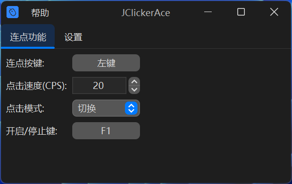
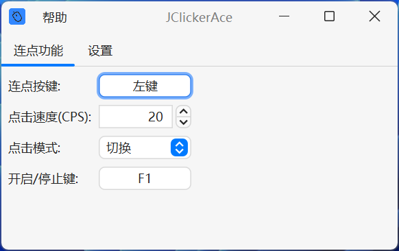

# JClickerAce-快速，好用的连点器

## 简介

JClickerAce是一个*开源*、使用Java编写的鼠标键盘连点器，它可以帮助你快速点击某个按键。  
外观使用了Swing和第三方库[FlatLaf](https://github.com/JFormDesigner/FlatLaf)构建，这使得外观更加现代化和扁平

## 获取

要获取 JClickerAce，您需要[下载](https://github.com/Youcheng-cat/JClickerAce/releases)本软件的最新版本（通常是`.exe`结尾的可执行文件）然后打开即可运行。

## 使用

JClickerAce的使用非常简单，只需要在`连点功能`主页面下点击选键按钮，然后按下您想选择的按键即可。设置完成以后，即可选择模式和速度，然后就能自由的连点了！  
下次再次打开时会保留原本的设置，配置保存在`%APPDATA%\YouChengCat\AutoClicker\config\confug.properties`文件中

## 许可证

本项目采用 MIT 许可证，详情参见 [LICENSE](LICENSE) 文件。

## 作者&贡献

**Youcheng-cat**（我自己）:[GitHub主页](https://github.com/Youcheng-cat)  [B站主页](https://space.bilibili.com/1727948844)  
其他贡献者:没有

本软件使用了一下一些库:
* [FlafLaf](https://github.com/JFormDesigner/FlatLaf)
* [FlatLaf-Extras](https://github.com/JFormDesigner/FlatLaf)
* [MigLayout](https://github.com/mikaelgrev/miglayout)
* [JNativeHook](https://github.com/kwhat/jnativehook)  
再次感谢开源创作者们的付出！

如果有意见，建议和见解，欢迎提出。
喜欢的话请点个star哦！  
_话说这屑作者一个学习用的小项目搞得跟重大发明似得_
